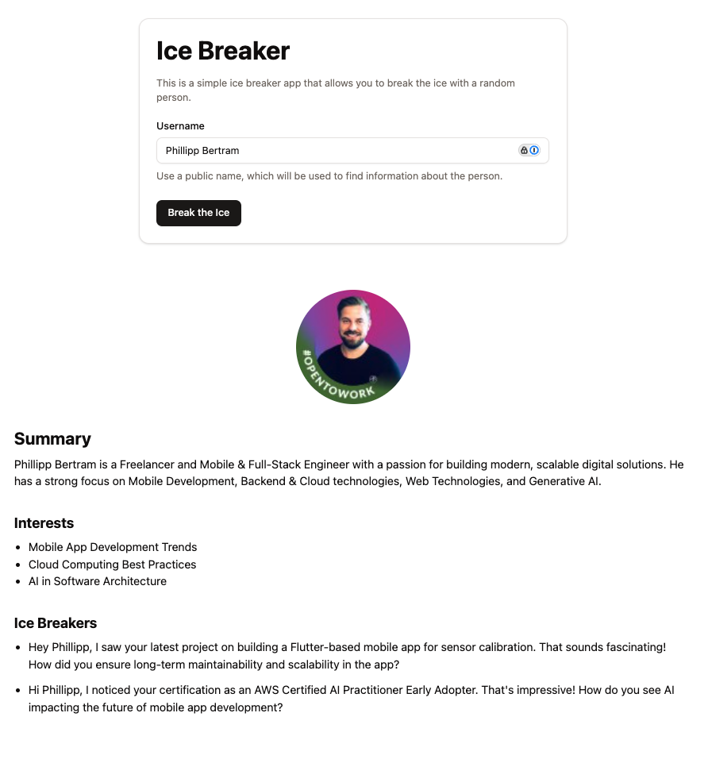

# Ice Breaker

Ice Breaker is a web application that crawls LinkedIn and Twitter data about a person to generate personalized ice breakers for networking and outreach.



---

## Features

- Scrapes LinkedIn and Twitter profiles for public data
- Uses AI to craft custom ice breakers based on the gathered information
- Integrates with OpenAI, Proxycurl, and Twitter APIs

---

## Prerequisites

Before running the project, ensure you have the following API keys and environment variables set in a `.env` file. To do that, simply copy the `.env.example` file to `.env` and fill in the values.

- > **Note:**
  >
  > - This project uses paid API services:
  >
  >   - [Proxycurl](https://www.proxycurl.com)
  >   - Twitter API (paid)
  >
  > - If you enable tracing (`LANGCHAIN_TRACING_V2=true`), you must provide a valid `LANGCHAIN_API_KEY`. Without it, the app will throw an error. If you don't need tracing, omit or comment out these variables.

---

## Getting Started

### 1. Clone the Repository

```bash
git clone https://github.com/phillippbertram/langchain-icebreaker.git
cd langchain-icebreaker
```

### 2. Install uv

If you don't have uv installed, you can install it with:

```bash
pip install uv
```

### 3. Install Dependencies

```bash
uv sync
```

### 4. Start the Flask Server

```bash
uv run python app.py
```

### 5. Open the Application

Open your browser and navigate to `http://localhost:5001` to access the application.

## License

[MIT](LICENSE)

---
